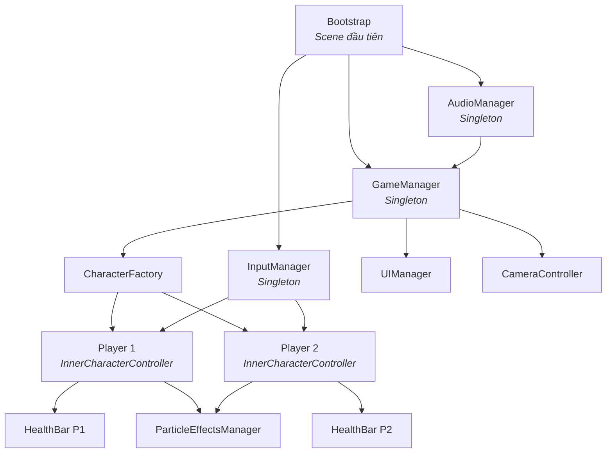
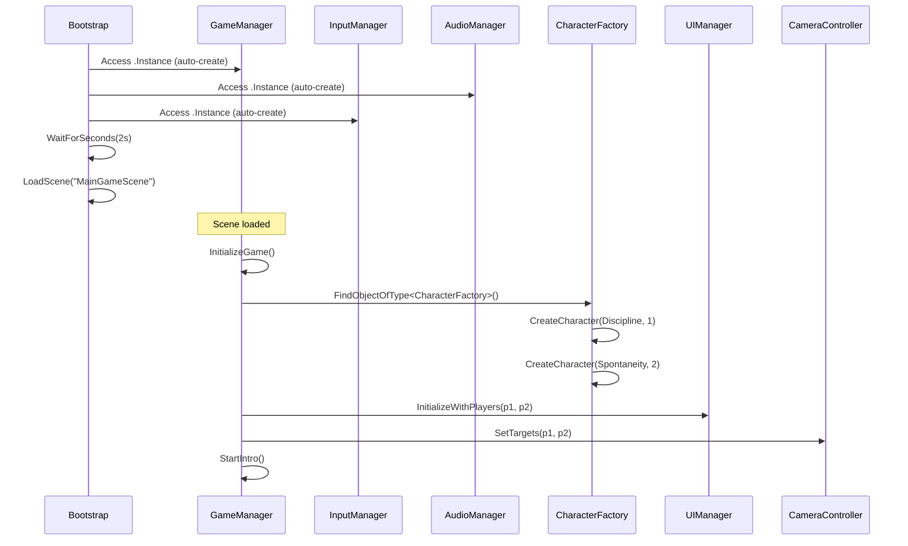

# Kiến trúc Hệ thống – Inner Duel

Tài liệu mô tả kiến trúc kỹ thuật của dự án, giúp team hiểu cách các hệ thống kết nối với nhau.

---

## Nguyên tắc thiết kế

1. **Separation of Concerns** – Tất cả asset nằm trong `Assets/_Project`, tách biệt với Third-Party plugins.
2. **Singleton Pattern** – Các Manager dùng chung kế thừa `Singleton<T>`, tự persist qua các scene.
3. **Bootstrap Initialization** – Scene `Bootstrap` khởi tạo tất cả core systems trước khi vào game.
4. **Data-Driven Characters** – Thông số nhân vật lưu trong `CharacterData`, tạo nhân vật qua `CharacterFactory`.
5. **Namespace Organization** – Mỗi module có namespace riêng dưới `InnerDuel.*`.

---

## Namespace Map

```
InnerDuel                    ← Root namespace (GameManager)
├── InnerDuel.Core           ← Singleton<T>, Bootstrap
├── InnerDuel.Input          ← InputManager, InputActions  
├── InnerDuel.Audio          ← AudioManager
├── InnerDuel.Characters     ← InnerCharacterController, CharacterFactory, 
│                              CharacterType, CharacterData, HealthBar
├── InnerDuel.Camera         ← CameraController
├── InnerDuel.UI             ← UIManager
└── InnerDuel.Effects        ← ParticleEffectsManager
```

---

## Sơ đồ hệ thống



---

## Chi tiết từng Module

### 1. Core – `InnerDuel.Core`

| Class | File | Vai trò |
|:---|:---|:---|
| `Singleton<T>` | `Core/Singleton.cs` | Base class cho MonoBehaviour Singleton. Thread-safe, auto-create, DontDestroyOnLoad. |
| `Bootstrap` | `Core/Bootstrap.cs` | Scene đầu tiên, khởi tạo tất cả Manager rồi load `MainGameScene`. |

**Singleton<T>** hoạt động:
- `Awake()` → Set instance, gọi `DontDestroyOnLoad`
- Nếu instance chưa tồn tại và có code gọi `.Instance` → tự tạo GameObject mới
- Nếu duplicate → `Destroy` bản thừa
- Khi application quit → flag `_applicationIsQuitting` ngăn tạo instance mới

### 2. Game – `InnerDuel`

| Class | File | Vai trò |
|:---|:---|:---|
| `GameManager` | `Game/GameManager.cs` | State machine chính: `Intro → Gameplay → Ending`. Quản lý vòng đời trận đấu. |

**Game States:**
```
[Intro] → Hiển thị triết lý, positioning nhân vật
   ↓
[Gameplay] → Chiến đấu, kiểm tra điều kiện thắng/thua
   ↓
[Ending] → Slow-motion, "HARMONY ACHIEVED", chuyển cảnh
```

**Chức năng chính:**
- `InitializeGame()` – Tìm `CharacterFactory`, spawn 2 nhân vật, setup Camera & UI
- `HandleGameplayState()` – Kiểm tra HP, phát hiện player chết
- `StartEnding()` – Kích hoạt kết thúc, slow-motion
- `RecoverPlayers()` – Tìm players nếu references bị mất (fallback)

### 3. Input – `InnerDuel.Input`

| Class | File | Vai trò |
|:---|:---|:---|
| `InputManager` | `Core/InputManager.cs` | Singleton quản lý input 2 người chơi. Đọc trạng thái input mỗi frame. |
| `InputActions` | `Core/InputActions.cs` | ScriptableObject kế thừa `InputActionAsset`, định nghĩa control bindings. |

**API chính:**
```csharp
InputManager.Instance.GetMoveInput(playerID)     // → Vector2
InputManager.Instance.GetButtonDown(playerID, "Attack")  // → bool (vừa nhấn)
InputManager.Instance.GetButton(playerID, "Block")       // → bool (đang giữ)
```

### 4. Character – `InnerDuel.Characters`

| Class | File | Vai trò |
|:---|:---|:---|
| `InnerCharacterController` | `Character/InnerCharacterController.cs` | Controller chính cho nhân vật. Xử lý movement, combat, abilities, state. |
| `CharacterFactory` | `Character/CharacterFactory.cs` | Factory pattern – tạo nhân vật từ prefab + data. Có fallback nếu prefab thiếu. |
| `CharacterType` | `Character/CharacterType.cs` | Enum 8 loại nhân vật + class `CharacterData` chứa stats. |
| `HealthBar` | `Character/HealthBar.cs` | UI component – thanh máu với hiệu ứng "delayed health" giảm từ từ. |

**CharacterData fields:**
```csharp
type, characterName, description
maxHealth, moveSpeed, attackDamage, defense
mainColor, effectColor
// Abilities flags:
canBlock, canDash, canPlaceTraps, hasLifeSteal,
canCounterAttack, hasBerserkMode, hasRageMode
```

**InnerCharacterController states:**
- Move / Idle / Attack / Block / Dash / Die
- Hỗ trợ: BerserkMode, DamageFlash, TakeDamage với defense calculation

### 5. Camera – `InnerDuel.Camera`

| Class | File | Vai trò |
|:---|:---|:---|
| `CameraController` | `Camera/CameraController.cs` | Dùng Cinemachine TargetGroup tự động zoom theo khoảng cách 2 player. Có ending sequence zoom-in + slow-motion. |

### 6. UI – `InnerDuel.UI`

| Class | File | Vai trò |
|:---|:---|:---|
| `UIManager` | `UI/UIManager.cs` | Quản lý 3 panel: Intro (triết lý), Gameplay (health bars), Ending (HARMONY ACHIEVED). Có typewriter + fade effects. |

### 7. Effects – `InnerDuel.Effects`

| Class | File | Vai trò |
|:---|:---|:---|
| `ParticleEffectsManager` | `Effects/ParticleEffectsManager.cs` | Quản lý particle effects: Hit (8 màu theo nhân vật), Block, Parry, Dash, Berserk, Harmony, LifeSteal. Tự tạo default effects nếu chưa gán. |

---

## Luồng khởi tạo Game (Boot Flow)



---

## Luồng dữ liệu Combat

```
InputManager.Update()
    └→ Đọc keyboard state → set MoveInput, AttackPressed, etc.

InnerCharacterController.Update()
    ├→ HandleMovement()    → Đọc InputManager.GetMoveInput()
    ├→ HandleAbilities()   → Đọc InputManager.GetButtonDown("Attack"/"Dash")
    │   └→ Attack()        → OverlapCircleAll(attackPoint, radius, opponentLayer)
    │       └→ opponent.TakeDamage(damage)
    │           ├→ HealthBar.SetHealth(currentHP)
    │           ├→ ParticleEffectsManager.PlayHitEffect()
    │           └→ AudioManager.PlayRandomHitSound()
    └→ UpdateAnimator()    → Set Animator parameters
```

---

## Layers & Physics

Game sử dụng **2 layer riêng** cho 2 player để hệ thống Hitbox/Hurtbox chỉ phát hiện đối thủ:

| Layer | Dùng cho |
|:---|:---|
| `Player1` | Nhân vật Player 1 |
| `Player2` | Nhân vật Player 2 |

`GameManager.SetCharacterLayers()` tự động gán layer khi spawn nhân vật.

---

## Quy tắc mở rộng

### Thêm nhân vật mới
1. Tạo prefab mới trong `Assets/_Project/Prefabs/Prefabs/Characters/`
2. Thêm `CharacterType` enum value trong `CharacterType.cs`
3. Thêm data trong `CharacterFactory.CreateDefaultCharacterData()`
4. Gán prefab vào slot tương ứng trên `CharacterFactory` trong scene

### Thêm Manager mới
1. Kế thừa `Singleton<T>` từ `InnerDuel.Core`
2. Thêm dòng `var myManager = MyManager.Instance;` trong `Bootstrap.InitializeManagers()`

### Thêm ability mới cho nhân vật
1. Thêm flag trong `CharacterData` (vd: `public bool canTeleport = false;`)
2. Implement logic trong `InnerCharacterController.HandleAbilities()`
3. Thêm Input Action nếu cần binding mới
